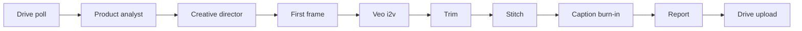
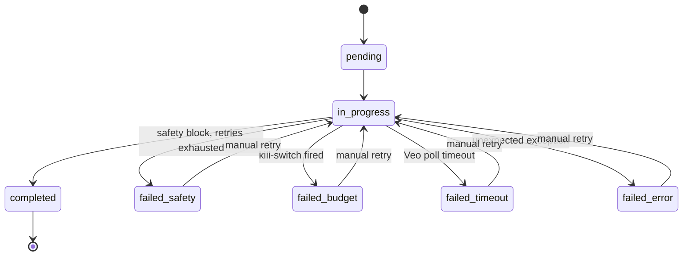

# Architecture

This document describes how `ugc-video-generator` turns a single product photo
into multiple short-form UGC videos. It is written for two readers: a reviewer
skimming for design rationale, and a contributor looking for the module map
and contracts between steps.

## High-level shape

The pipeline is **image-first** and **idempotent end-to-end**. Each product
yields N videos; each video is composed of K image-to-video clips that are
trimmed, stitched, and captioned. State is checkpointed to disk between every
step so any failure is resumable without re-spending on generative APIs.

Two design choices shape everything else:

1. **Image-first composition.** A static first frame is generated and locked
   *before* any video model is invoked. The frame is the only source of
   product truth, so the i2v model never has to "imagine" the product from a
   text description — it animates the pixels it is given. This eliminates a
   whole class of subtle product drift across clips.
2. **Idempotent, file-backed steps.** Every step's "completed" marker is the
   presence of its output artifact on disk plus a state record. Re-running
   the orchestrator is safe: completed steps are skipped, in-flight Veo
   operations are resumed by polling their long-running operation IDs.

## Steps in one paragraph each

- **Drive poll** — watches the configured `input/` Drive folder for new
  product photos, downloads each one to local `assets/`, and emits a
  `ProductBrief` containing the image path and metadata.
- **Product analyst** — sends the product photo to a Gemini vision model
  with a structured-output prompt and gets back a `ProductAnalysis` (visual
  description, material, color palette, suggested mood). Brand-specific
  copy and constraints come from `brand_guidance.yaml`, never from the
  model.
- **Creative director** — turns the analysis into N distinct `VideoSpec`s,
  each with a talent (drawn from `talent_pool.yaml`), a setting, a tone,
  a per-clip scene description, and Italian voiceover script blocks. This
  is the only place where N (videos per product) and K (clips per video)
  are decided.
- **First frame** — for each clip, composes a single 9:16 frame using a
  Gemini image-generation model with the product photo as a reference
  input. The output is a PNG that anchors the clip's identity.
- **Veo i2v** — submits each first frame to Veo 3.1 Fast as an
  image-to-video job, then polls the long-running operation. Per-clip
  prompt is purely deictic ("the object in the starting frame…") — no
  product description is ever sent, since the image is authoritative.
- **Trim** — re-encodes each generated clip to the exact target duration
  with ffmpeg, normalizing framerate and audio so the downstream concat
  is seamless.
- **Stitch** — concatenates the trimmed clips with a short crossfade
  (`transition_seconds` in config) into a single video per spec.
- **Caption burn-in** — runs faster-whisper locally on the stitched audio
  to produce word-level timings, renders an `.ass` subtitle file, and
  burns subtitles in with ffmpeg. faster-whisper is local and free, so
  caption generation never gates on a paid API.
- **Report** — emits a JSON report per video summarizing the spec, the
  prompts used, model versions, durations, and a cost breakdown.
- **Drive upload** — uploads the final captioned MP4 and the report back
  to the configured Drive output folder, then marks the video
  `completed`.

## Orchestrator, state, and resumability

The orchestrator drives the pipeline as nested async loops (product →
video → clip) bounded by per-API rate limiters and a Veo concurrency
semaphore. Two pieces make resumability work:

- **State manager** writes one JSON file per video (`VideoState`) and one
  per run (`RunState`) using atomic rename. Each step records its
  artifacts, the prompt versions it used, and any model job IDs. On
  restart, the orchestrator loads these files, sweeps stale locks, and
  drains in-flight Veo operations before scheduling new work.
- **Cost tracker** maintains a running `CostBreakdown` per video and a
  global kill-switch. Before each paid call the orchestrator admits the
  batch against the remaining budget; if the kill-switch fires, the
  affected videos are marked `failed_budget` and the run exits cleanly
  — the next run will pick up from the same checkpoints. A
  `dry-run-cost` CLI subcommand estimates the bill without making any
  paid calls.

## Prompt design

Prompts are split into five small modules (`prompts/analyst.py`,
`director.py`, `first_frame.py`, `veo.py`, `safety_retry.py`) for two
reasons. First, each step has a different contract — structured JSON for
the analyst and director, image-conditioned text for the first-frame
generator, deictic narration for Veo — and mixing them in one module
makes it too easy to leak product description into the i2v prompt.
Second, prompt versions are stamped into `VideoState` (a sha256 of the
rendered template), so changing a prompt is a traceable event rather
than a silent regression.

The voiceover language is Italian; pipeline scaffolding, code, and logs
are English. faster-whisper is configured with `language="it"`
accordingly.

`safety_retry.py` is the recovery path for image-gen or Veo safety
blocks: it asks the upstream model to re-author the offending prompt
with the same intent but softer wording, up to a configured retry
count. After that the video is marked `failed_safety` and surfaces in
the CLI's `list-failed`.

## Failure modes

- **Safety blocks** are handled per-clip with the bounded retry above.
- **Veo timeouts** are bounded by a configurable poll deadline; a
  timed-out operation marks the video `failed_timeout` but the LRO ID
  is preserved, so a subsequent run can keep polling.
- **Drive failures** (upload or download) are retried with exponential
  backoff; if Drive credentials are absent the run still completes
  locally and the video is marked `completed_local`.
- **Unexpected exceptions** are caught at the video boundary so one bad
  video never poisons the whole product run.

## Cloud-portability

The repo runs locally on Windows today, but every step is structured to
move to a cloud worker without rewrites: artifacts go through a single
`state/` and `artifacts/` directory abstraction, every external call
goes through a thin client wrapper, the orchestrator is async and
stateless across restarts, and the only host-specific dependency is
ffmpeg on `PATH`. Swapping the local filesystem for object storage and
the single-process orchestrator for a queue-driven worker is an
infrastructure change, not a code rewrite.
