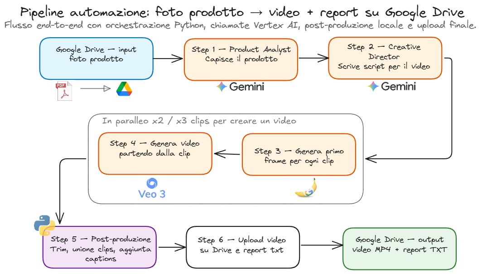

# ugc-video-generator

Automated pipeline that turns a single product photo into multiple short-form
UGC-style videos (vertical 9:16, 15–30 seconds), suitable for Reels / TikTok /
Shorts.

## What it does

Given a product photo dropped into a Google Drive `input/` folder, the pipeline
generates **N UGC videos per product** — each with a different talent, script
and setting — and uploads the finished videos plus a per-video report back to
Drive.

The pipeline is image-first: a static first frame is composed first, then
animated, then post-produced (trim, stitch, burned-in captions). State is
checkpointed to disk so any failure is resumable.

For a design overview see [`ARCHITECTURE.md`](./ARCHITECTURE.md).



## Stack

- **Gemini 2.5 Pro** — product analysis + creative direction (script, settings)
- **Gemini image generation** (Gemini 2.5 / 3 Flash Image) — talent renders +
  first-frame composite
- **Veo 3.1 Fast** — image-to-video generation
- **faster-whisper** — local audio transcription (free)
- **ffmpeg** — trim, concat, caption burn-in
- **Google Drive API** — input polling + output upload

## Setup

**Requirements:** Python 3.12+, `ffmpeg` on `PATH`, a GCP project with the
Vertex AI and Google Drive APIs enabled, and a service account JSON with
`roles/aiplatform.user` (Vertex) plus Editor access on the Drive folders.

1. Create and activate a virtual environment (Windows / PowerShell):

   ```powershell
   python -m venv .venv
   .venv\Scripts\Activate.ps1
   pip install -e ".[dev]"
   ```

2. Copy the config and env templates:

   ```
   cp .env.example .env
   cp config/pipeline_config.example.yaml config/pipeline_config.yaml
   cp config/talent_pool.example.yaml      config/talent_pool.yaml
   cp config/brand_guidance.example.yaml   config/brand_guidance.yaml
   ```

3. Fill in `.env` with your GCP project ID, Drive folder IDs, and the path
   to the service account JSON.

4. Run the pipeline:

   ```
   python -m ugc_pipeline.main
   ```

## Operational CLI

A separate CLI exposes status, retry and cost-estimation commands:

```
python -m ugc_pipeline.cli --help
python -m ugc_pipeline.cli status
python -m ugc_pipeline.cli dry-run-cost
python -m ugc_pipeline.cli retry <video_id>
```

## Tests

Unit tests are free and run with `pytest tests/ -v`. Paid integration tests
against Gemini are gated behind the `UGC_RUN_PAID_TESTS=1` environment
variable. Veo and image-generation calls are mocked everywhere, including in
the end-to-end test.

## Privacy note

This repository is intentionally generic and brand-agnostic. Brand-specific
configuration, prompts, assets and internal planning documents are kept local
and excluded via `.gitignore`.
